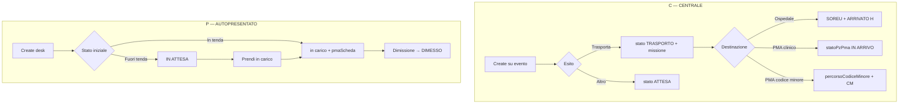

# Paziente — mappa campi e dipendenze

**Path Firestore:** `manifestazioni/{tenantId}/pazienti/{docId}`  
**Subcollection:** `…/valutazioniSoccorso/{valId}`

**Legenda tipo origine (`tipoPz`):**

| Sigla | Valore | Descrizione |
|-------|--------|-------------|
| **C** | `CENTRALE` | Creato/gestito da centrale; può avere missione e destinazione PMA/ospedale |
| **P** | `PMA` | Autopresentato al PMA (fuori tenda o in tenda) |
| **CM** | `CODICE MINORE` | Astanteria PMA; no cartella clinica completa |

**Due assi di stato (non confonderli):**

| Asse | Campo | Valori | Chi lo usa |
|------|-------|--------|------------|
| Centrale / trasporto | `stato` | `ATTESA`, `TRASPORTO`, `ARRIVATO H` (+ `PMA` solo autopresentato) | Elenco centrale, missioni, sync mezzo |
| PMA / tenda | `statoPzPma` | `IN ARRIVO`, `IN ATTESA`, `in carico`, `DIMESSO` | Desk PMA, cartella, dimissione |

**Regola scritture nested:** `pmaScheda` va sempre patchato **campo per campo** (`patchPazientePmaGranular`), mai l’oggetto intero.

---

## 1. Identità e collegamenti

| Campo | Tipo | C | P | CM | Scrittura | Dipendenze / effetti |
|-------|------|---|---|----|-----------|----------------------|
| `_docId` | string | ● | ● | ● | create | UUID Firestore; chiave operativa |
| `manifestationId` | string | ● | ● | ● | create | Scope tenant; tutte le query |
| `idUnivoco` | string | ● | ● | ● | create | Id stabile cross-sistema |
| `idPaziente` | string | ● | ● | ● | create (`allocateProgressiveId`) | Display `P1`, `P2`…; PDF, export, desk |
| `tipoPz` | enum | default C | W: create PMA | W: create CM | Determina moduli UI, valutazioni, `pmaScheda` |
| `eventoIdUnivoco` | string | W: create da evento | vuoto | vuoto / transport | Link evento; cleared su detach missione-PMA |
| `eventoCorrelato` | string | W: create (`E1`…) | vuoto | transport | Display; export |
| `idMissione` | string | W: esito Trasporta | — | transport | ↔ missione; sync stati |
| `missioneIdUnivoco` | string | W: esito Trasporta | — | transport | ↔ doc missione |
| `pmaId` | string | mirror dest. PMA | W: create | W: create | Filtro desk PMA (`pazienteVisibileInPmaDesk`) |
| `destinazionePmaId` | string | W: select dest. | = `pmaId` | = `pmaId` | Trigger `setPazientePmaInArrivo`, init scheda/codice minore |

---

## 2. Anagrafica (top-level)

| Campo | Tipo | C | P | CM | Scrittura | Dipendenze / effetti |
|-------|------|---|---|----|-----------|----------------------|
| `nome`, `cognome` | string | W: `PazienteScheda` | W: quick form + tab anagrafica | W: form CM / auto da mezzo | Registry pettorale; export; desk display |
| `pettorale` | number | ● | ● | **richiesto** (native) | Lookup `registryPartecipanti`; display `(Pett. N)` |
| `dataNascita` | string ISO | ● | ● | ● | Calcolo `eta`; anagrafica |
| `eta` | number | ● | ● | ● | Da DOB o manuale |
| `sesso` | M/F/Altro | ● | ● | raro | Anagrafica |
| `telefono` | string | ● | ● | ● | Anagrafica; registry |
| `comune`, `indirizzo` | string | ● | ● | — | Anagrafica centrale/PMA |
| `notePaziente` | string | ● | ● | seed CM | In PMA → `note_centrale` (adapter); append su detach missione |
| `email` | string | — | W: dimissione PMA | — | Adapter top-level patch |
| `codice_fiscale` / `codiceFiscale` | string | — | W: scanner PMA | — | PDF / anagrafica PMA |

**Gate anagrafica PMA:** solo **P** editabile in tab anagrafica (`canEditPmaAnagrafica`). **C** inviato al PMA = sola lettura in PMA.

---

## 3. Stato centrale (`stato`, `aperta`, trasporto)

| Campo | Tipo | C | P | CM | Scrittura | Dipendenze / effetti |
|-------|------|---|---|----|-----------|----------------------|
| `stato` | string | missione + UI | fisso `PMA` | `PMA` | `fieldsPerEsito`, `applyMissioneArrivatoH`, sync missione |
| `aperta` | boolean | lifecycle | fino a dimissione | fino a `oraFine` | `pazienteInElencoAperti/Chiusi`, `isChiusoCentrale` |
| `apertura` | Timestamp | create | create | create | Orario apertura scheda |
| `arrivatoHAt` | Timestamp | W: `ARRIVATO H` | — | transport | Chiusura centrale; elenco chiusi |
| `esito` | string | W: UI | — | — | Se `Trasporta` → link missione, SOREU ospedale |
| `esitoAltro` | string | se esito Altro | — | — | |
| `mezzo` | string | W: missione | — | transport | Cap 3 pazienti/ mezzo; sync Telegram/GPS |
| `codiceColoreSanitario` | Bianco…Rosso | W: valutazioni MSB/MSA | raro | — | Sync → `pmaScheda.codice_colore` se non bloccato |
| `codiceColore` | string | legacy read | — | — | Fallback normalize |

**Gate:** `isTrasportoCentraleModificabile` = false dopo `ARRIVATO H` o `aperta: false`. **P** e **CM** non modificano esito/mezzo centrale.

**Relazione con PMA:** dopo `ARRIVATO H` verso PMA clinico → **C** chiuso centrale ma `statoPzPma` resta `IN ARRIVO` fino a «Prendi in carico».

---

## 4. Stato PMA (`statoPzPma`)

| Valore | C (→ PMA) | P (autopresentato) | CM |
|--------|-----------|-------------------|-----|
| `IN ARRIVO` | DIRETTO H / dest. PMA | raro | — |
| `IN ATTESA` | da desk «Metti in attesa» | default create fuori tenda | — |
| `in carico` | desk «Prendi in carico» | default in tenda / toggle | create / ARRIVATO H transport |
| `DIMESSO` | dimissione PMA | dimissione | `codiceMinore.oraFine` |

| Scrittura | Servizio / UI |
|-----------|---------------|
| `IN ARRIVO` | `pazientePmaMissionSync`, `setPazientePmaInArrivo` |
| `IN ATTESA` | `mettiInAttesaPma`, `setStatoPmaAutopresentato` |
| `in carico` | `prendiInCaricoPma` (+ `pmaScheda.ingresso_carico_at`) |
| `DIMESSO` | dimissione (`splitPazientePatch` stato dimesso) |

**Gate cartella clinica:** `canEditPmaSchedaDoc` richiede `in carico` OR `schedaModificaForzata`.  
**Gate sync colore centrale→PMA:** bloccato se `IN ATTESA`, `in carico`, `DIMESSO` o `ingresso_carico_at` (`pmaCodiceColoreSyncBlocked`).

---

## 5. Destinazione e SOREU (centrale → ospedale)

| Campo | Tipo | C | P | CM | Dipendenze |
|-------|------|---|---|----|------------|
| `ospedaleDestinazione` | string | ospedale o nome PMA | nome PMA | nome PMA | Select dest.; prefill `invio_ps_ospedale` |
| `percorsoCodiceMinore` | boolean | W: dest. CM | — | transport | Salta scheda clinica; init `codiceMinore` |
| `soreuOraMissione` | Timestamp | se ospedale (non PMA) | — | — | `destinazioneRichiedeSoreu`; draft on blur |
| `soreuNumeroMissione` | string | idem | — | — | idem |
| `soreuAccompagnato` | string[] | NO/MEDICO/INFERMIERE | — | — | idem |
| `soreuCodice` | B/V/G/R | idem | — | — | idem |

**P** e **CM** non usano SOREU root (solo `pmaScheda.invio_ps_soreu_*` se dimissione invio PS).

---

## 6. Flag e meta

| Campo | Tipo | C | P | CM | Dipendenze |
|-------|------|---|---|----|------------|
| `schedaModificaForzata` | boolean | ● | ● | ● | `SchedaUnlockBar`; sblocca edit scheda chiusa |
| `valutazioniSoccorso` | array | **legacy** (migrato in subcollection) | — | — | Solo lettura/migrazione |

---

## 7. `pmaScheda` — cartella clinica PMA

Presente per **C→PMA clinico** e **P**. **Assente per CM.**

| Subfield | Tipo | Edit gate | Dipendenze principali |
|----------|------|-----------|------------------------|
| `ingresso_carico_at` | Timestamp | auto | W: presa in carico; **blocca sync colore da centrale** |
| `codice_colore` | bianco/verde/giallo/rosso | in carico | Seed da `codiceColoreSanitario`; conflitto → prompt |
| `breve_descrizione` | string | in carico | Riepilogo, PDF |
| `apr`, `app`, `allergie` | string | in carico | Cartella |
| `allergie_verifica` | si/no/non_noto | in carico | **Obbligatorio** prima edit cartella |
| `EO_*`, `eo_note` | string[] / string | in carico | EO rapido da impostazioni |
| `parametri_vitali[]` | array | in carico | merge-by-id; PDF |
| `farmaci[]` | array | in carico | merge-by-id; catalogo impostazioni |
| `rivalutazioni[]` | array | in carico | merge-by-id |
| `lesioni[]` | array | in carico | Omino SVG (≠ MSB/MSA tuples) |
| `prestazioni_sel[]` | string[] | in carico | Lista impostazioni PMA |
| `ecg_cloudinary_url` | string | in carico | Upload Cloudinary |
| `tipo_evento`, `dettaglio_evento` | string | in carico | Seed da evento centrale o form P |
| `medico_rif`, `infermiere_rif` | string | in carico | Soft ref; **medico_rif obbligatorio** a dimissione |
| `dimissione_esito` | enum | in carico / post-chiusura parziale | Apre sezione invio PS se `invio_ps` |
| `dimissione_note` | string | idem | PDF |
| `affidatario_*` | string | se riaffidato | Dimissione |
| `firma_paziente_base64` | string | dimissione | PDF, iPad firma |
| `dimissione_firma_medico_base64` | string | dimissione | PDF |
| `dimesso_at` | Timestamp | dimissione | → `statoPzPma: DIMESSO`, `aperta: false` |
| `invio_ps_*` | vari | se esito invio PS | Edit anche scheda chiusa (matrice ruoli) |
| `invio_ps_soreu_*` | vari | se invio PS | SOREU trasporto 118; `InvioPsSoreuTrasportoBlock` |

**Array item shapes:** PV (`id`, GCS, FC, PA, SpO2…), farmaco (`id`, nome, dose, via), rivalutazione (`id`, testo, firma), lesione (`n`, vista, x, y, descrizione).

---

## 8. `codiceMinore` (solo CM)

| Subfield | CM native | CM da transport C | Dipendenze |
|----------|-----------|-------------------|------------|
| `motivoArrivo` | W | seed evento/note | Panel codici minori |
| `trattamento` | W | W | |
| `oraArrivo` | — | W: ARRIVATO H | |
| `oraFine` | W: chiusura | W | → `statoPzPma: DIMESSO` |
| `daTrasportoCentrale` | — | flag | |
| `provenienzaTrasporto` | — | testo detach | |
| `foto[]` | W | W | Storage upload |

**Gate:** escluso da desk colonne cliniche; no `pmaScheda`.

---

## 9. Valutazioni soccorso (subcollection) — solo **C**

**Path:** `pazienti/{id}/valutazioniSoccorso/{valId}`

| Campo doc | MSB | MSA | Dipendenze |
|-----------|-----|-----|------------|
| `tipo` | MSB | MSA | UI tab valutazioni (`PazienteScheda`) |
| `testo`, `creatoIl`, `mezzo` | ● | ● | Storico |
| `msbDetails` | ● | — | AVPU, vitals, lesioni tuple, codiceColore, esitoMsb, mezzoMsb… |
| `msaDetails` | — | ● | ACC arresto, parametri, farmaci[], codiceColore… |

**Sync:** `codiceColoreSanitarioFromValutazioni` → `codiceColoreSanitario` paziente → opz. `pmaScheda.codice_colore`.  
**P** e **CM:** nessuna subcollection in flusso normale.

---

## 10. Flussi per tipo (sintesi)

---

## 11. Indice file sorgente

| Area | File principali |
|------|-----------------|
| Tipi / adapter | `src/pma/types/paziente.ts`, `src/pma/adapters/crossPazienteAdapter.ts` |
| Stati | `src/lib/pmaModule.js`, `src/lib/pazienteStati.js` |
| Defaults scheda | `src/pma/lib/pmaSchedaDefaults.ts` |
| Create / patch | `src/services/pazientiService.js`, `src/pma/lib/pazientePmaPatch.js` |
| Sync missione↔PMA | `src/services/pazientePmaMissionSync.js` |
| Stati PMA | `src/services/pmaStatoService.js` |
| Sync colore | `src/lib/pazienteSyncGuard.js` |
| UI centrale | `src/components/pazienti/PazienteScheda.jsx` |
| UI PMA | `src/components/pazienti/moduli/PazienteModuloPma.jsx`, `CartellaClinicaSection.tsx`, `DimissioneSection.tsx` |
| Draft merge | `src/lib/pazienteDraftMerge.js` |
| Integrazione | `Integrazione/Prompt per integrazione con CROSS.txt` |

---

*Generato da analisi codebase CROSS — giugno 2026. Per modifiche al modello paziente, verificare sempre `splitPazientePatch`, `assertPazientePatchGranular` e test in `src/lib/missionPmaPatientClose.test.js`, `pmaCartellaClinicaMultiOp.test.js`.*
